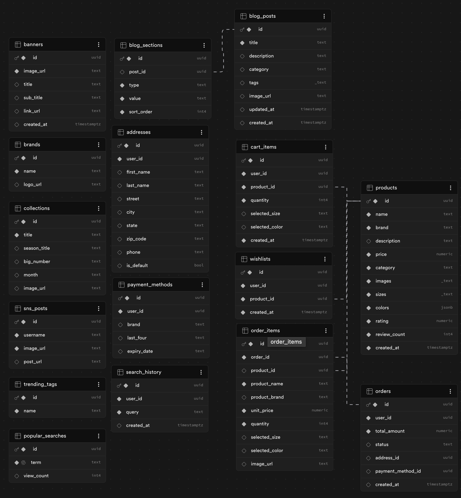

# 📱 React Native 기반 프리미엄 커머스 앱 (Open Fashion)

제공된 Figma 디자인을 기반으로 상품 탐색부터 최종 주문까지 이어지는 이커머스의 흐름을 구현한 프로젝트입니다.

## 1. 실행 방법 (Installation)

### 설치 및 실행

- **환경 변수**: 제공된 `.env.example` 파일을 복사하여 `.env` 파일을 생성하고 Supabase 프로젝트 정보를 입력해야 정상 동작합니다.
- **테스트**: iOS 시뮬레이터(i), Android 에뮬레이터(a) 또는 Expo Go 앱을 통해 확인 가능합니다.

```bash
npm install
# 환경 변수 설정 (.env.example 참고하여 .env 생성)
npx expo start
# 만약 MacOS 에서 안드로이드 실행시 에러가 나면 Android Studio로 에뮬레이터 실행 후 안드로이드 실행

# iOS, Android 따로 실행
# iOS
npm run ios
# Android
npm run android
```

<br/>

## 2. 프로젝트 구조 (Project Structure)

유지보수와 확장을 위해 기능을 계층적으로 분리하였으며, 초기 개발 과정에서 발견된 UI 불일치를 해결하기 위해 **공통 컴포넌트 중심**의 리팩토링을 거쳤습니다.

- `app/`: Expo Router 기반 파일 시스템 라우팅 (Route Layer)
- `src/api/`: Supabase 연동 및 전용 데이터 서비스 (Service Layer)
- `src/components/`: 재사용 가능한 UI 단위 (Header, Footer, ProductCard 등)
- `src/hooks/`: 비즈니스 로직과 API 호출을 분리 (Logic Layer)
- `src/store/`: Zustand 기반 글로벌 상태 관리 (State Layer)
- `src/types/`: TypeScript 타입 정의 (Type Layer)

```bash
.
├── app
│   ├── blog
│   └── product
├── scripts
└── src
    ├── api
    │   └── services
    ├── components
    │   ├── blog
    │   ├── checkout
    │   ├── common
    │   ├── home
    │   ├── products
    │   ├── search
    │   └── ui
    ├── constants
    │   └── theme
    ├── data
    ├── hooks
    ├── store
    ├── types
    └── utils
```

<br/>

## 3. 상태 관리 및 데이터 저장 (State & Storage)

### Zustand & AsyncStorage

- **선택 이유**: 복잡한 설정 코드 없이도 장바구니 기능을 빠르게 구현할 수 있고, 코드를 읽기에도 훨씬 편하다는 장점 때문에 선택했습니다.
- **데이터 유지 (Storage)**: 장바구니와 찜 목록은 Supabase에 저장되어 앱을 재실행해도 서버에서 불러와 복구됩니다. 뷰 모드(그리드/리스트/갤러리) 설정처럼 서버까지 올릴 필요 없는 UI 상태는 Zustand의 `persist` 미들웨어와 AsyncStorage를 활용해 기기 로컬에 저장하고, 재실행 시 자동 복구되도록 구현했습니다.

<br/>

## 4. DB 설계 및 데이터 모델링 (Supabase)

### UI에서 역으로 도출한 스키마 (UI-Driven Design)

처음부터 완벽한 스키마를 정해두고 시작하기보다, **사용자가 실제로 보게 될 화면(UI)에 필요한 정보가 무엇인지를 우선순위로 두고 테이블을 설계**했습니다. 덕분에 불필요한 필드는 줄이고, 실제 화면에 꼭 필요한 데이터만으로 테이블을 구성할 수 있었습니다.

- **중심이 되는 Products**: 장바구니, 위시리스트, 주문서 등 모든 테이블이 Products를 참조하도록 설계하여 데이터가 한 곳에서 관리되도록 했습니다.
- **JSONB를 활용한 유연한 상품 옵션**: 의류나 악세서리 등 상품마다 옵션(사이즈, 색상 등)이 제각각인 특성을 고려했습니다. 이를 고정된 컬럼이 아닌 JSONB 타입으로 관리하여, 제품군이 늘어나도 스키마를 바꾸지 않고 유연하게 대응할 수 있게 만들었습니다.
- **안전한 주문 처리**: 사용자가 결제 버튼을 누르는 마지막 5단계에서만 서버에 주문 기록을 남김으로써, 중간에 이탈하거나 취소해도 데이터가 꼬이거나 쓰레기 값이 쌓이지 않도록 안전하게 처리했습니다.
<div align="center">
  
  <p><em>(Supabase Schema Visualizer를 통한 데이터 관계도)</em></p>
</div>
<br/>

## 5. 구현 범위 (Implementation Scope)

### 필수 구현

- **홈**: 제공된 디자인 중심의 레이아웃 및 상품 카드 UI.
- **상품 상세**: 옵션 선택 후 유효성 검사를 거쳐 장바구니에 추가. 또한 사용자에게 장바구니로 이동할지 쇼핑을 계속 할지 묻는 Alert 추가.
- **장바구니**: 수량 조절, 실시간 합계 계산 및 **중복 품목 합산** 구현.
- **5단계 주문 흐름**: `Setup` → `Shipping` → `Payment` → `Summary` → `Success` 프로세스 구현.

### 선택 구현

- **찜하기(Wishlist)**: 앱을 재실행 하더라도 유지될 수 있는 찜(Wish) 관리 기능.
- **필터 및 정렬**: 카테고리별 실시간 필터링 시스템.
- **동적 뷰 모드**: 그리드/리스트/갤러리 형태의 레이아웃 스위처.
- **커스텀 애니메이션**: Reanimated를 활용한 캐러셀 및 레이아웃 트랜지션.

<br/>

## 6. 기술적 선택 이유 (Technical Choice)

- **에셋 및 로딩 최적화**: 디자인 가이드의 텍스트가 포함된 이미지를 그대로 내보내기(Export) 하지 않고, **텍스트와 스타일 코드로 직접 구현**했습니다. 이는 앱 전체 용량을 줄이고 로딩 속도를 개선하며, 다양한 기기 해상도에서도 텍스트 정렬이 깨지지 않도록 하기 위한 선택이었습니다.

<br/>

## 7. AI 활용 방식 (AI Utilization)

이번 프로젝트에서 Claude, Gemini를 단순 코드 생성기가 아닌 '**설계 및 디버깅 파트너**'로 활용했습니다.

- **요구사항 해석 및 구체화**: 복잡한 체크아웃 5단계의 상태 흐름 로직을 AI와 함께 설계하고 검증했습니다.
- **플랫폼 기반 문제 해결**: 안드로이드 전용 폰트 렌더링 및 개행 문자(`\n`) 무시 현상 등 안드로이드가 인식할 수 있게 폰트 파일 이름과 import 방식을 수정해 해결했습니다.
- **무결성 검증**: 최종 제출 전 새 환경에서 처음부터 클론해 실행해보며 동작을 확인했습니다.

<br/>

## 8. 문제 해결 과정 (Problem Solving)

#### 1. UI 우선 스키마 설계(Data Modeling)

- **문제**: 초기 단계에서 완벽한 데이터 구조를 설계하려 할 경우, 실제 UI 구현 단계에서 필요한 필드가 누락되거나 불필요한 필드가 생성되는 비효율 발생.
- **해결**: 화면 구현을 우선 진행한 뒤, 각 컴포넌트가 실제로 필요한 데이터를 기준으로 스키마를 정의했습니다. 특히 상품 데이터 조회 시 함께 필요한 옵션 정보(색상 등)는 별도 테이블 정규화 대신 **JSONB**로 통합하여 Join 비용을 줄이고 조회 성능을 높였습니다.

#### 2. 에셋 최적화 및 반응형 레이아웃 대응 (UI Performance)

- **문제**: 디자인 에셋 중 텍스트가 포함된 이미지를 그대로 사용할 경우, 번들 용량 증가 및 기종별 해상도 변화에 따른 수치 왜곡 우려.
- **해결**: 이미지 내 텍스트를 모두 분리하여 코드로 직접 구현했습니다. 반응형 Scale 시스템을 적용하여 디바이스 크기에 상관없이 텍스트 가독성과 레이아웃 일관성을 확보하고 전체 에셋 로딩 속도도 개선했습니다.

#### 3. ProductCard 컴포넌트 통합 (ProductCard Refactoring)

- **문제**: 다양한 뷰 모드(Grid, List, Large)에 대응하기 위해 각기 다른 컴포넌트를 작성할 경우, 동일한 라우팅 및 상태 관리 로직이 중복되는 문제 발생.
- **해결**: 세 가지 뷰를 `ProductCard`라는 단일 컴포넌트로 통합하고 `variant` prop에 따라 스타일만 분기되는 구조로 설계하여 중복 로직을 제거하고 홈, 검색, 위시리스트 등 여러 화면에서 재사용할 수 있게 했습니다.

#### 4. 모바일 환경에 최적화된 UX 재구성 (Detail Page)

- **문제**: Figma에 나열된 모든 상세 정보를 펼쳐진 상태로 구현할 경우, 모바일 기기에서의 과도한 스크롤 발생 및 사용자 맥락 이탈 가능성.
- **해결**: 갤러리나 배송 안내 등 영역을 많이 차지하는 섹션을 **Accordion(토글)** 처리해 정보 밀도를 줄이고, 디자인을 단순 복제하는 것보다 실제 사용성을 우선하여 정보의 순위를 정리했습니다.

#### 5. 결제 단계별 상태 관리 (Persistence)

- **문제**: 결제 플로우 5단계를 진행하는 동안 스텝 간 데이터가 유실되는 문제 발생.
- **해결**: 단일 `checkout.tsx` 내 상태 전환 구조를 채택하여, 앱 재실행 후에도 유지되어야 하는 로컬 설정은 `AsyncStorage`를 활용하고, `Zustand`의 `persist` 미들웨어를 통해 뷰 모드 등이 자동으로 복구되도록 구현하여 각 저장소의 역할을 명확히 분리했습니다.

#### 6. 주문 데이터의 무결성을 위한 스냅샷 설계 (Order Integrity)

- **문제**: 주문 완료 후 원본 상품 정보나 가격이 변경될 경우, 과거의 주문 내역의 가격, 상품명도 함께 바뀌어버리는 문제 발생.
- **해결**: `order_items` 저장 시 주문 시점의 상품명과 가격을 직접 기록하는 **스냅샷 방식**을 채택하고, 배송지 정보 또한 `orders.shipping_address`에 JSONB 타입으로 복사하여, 마스터 데이터의 변화와 관계없이 거래 확정 시점의 기록이 유지되도록 설계했습니다.

#### 7. 플랫폼별 SafeArea 및 시스템 간섭 대응 (Cross-Platform)

- **문제**: Android의 시스템 네비게이션 방식(3버튼 vs 제스처)에 따른 하단 여백 불일치 및 iOS 노치 커버 이슈.
- **해결**: 상단은 SafeAreaView에 edges 옵션으로 top만 적용하고, 하단은 useSafeAreaInsets로 insets.bottom 값을 읽어 0보다 크면 그 값을, 아니면 기본 20을 패딩으로 적용해 네비게이션 바 유무에 관계없이 액션 버튼이 가려지지 않도록 했습니다.

#### 8. 시나리오별 예외 처리 및 사용자 피드백 (User Feedback)

- **문제**: 비정상적인 접근(옵션 미선택 담기, 빈 장바구니 주문 등) 시 적절한 안내가 누락될 경우 발생할 수 있는 사용자 이탈 문제 인식.
- **해결**: 핵심 유저 흐름 전반에 유효성 검사 로직을 배치하고 `Alert`를 통해 피드백을 제공했습니다. 옵션 선택 유도, 중복 항목 수량 합산 확인, 주소 누락 안내 등 주요 예외 상황을 처리하여 UX 흐름이 끊기지 않도록 했습니다.
